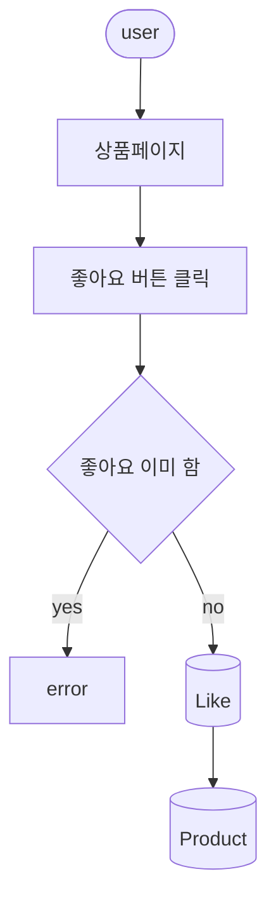
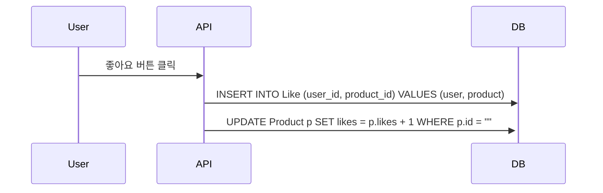

```mermaid
flowchart TB
    u([user]) -->
    p[상품페이지] -->
    l[좋아요 버튼 클릭] -->
    l-1{좋아요 이미 함} -- yes --> error
    l-1{좋아요 이미 함} -- no --> db-l
    db-l[(Like)] --> db-p
    db-p[(Product)]
```

```mermaid
sequenceDiagram
    participant User
    participant API
    participant DB
    
    User ->> API: 좋아요 버튼 클릭
    API ->> DB: INSERT INTO Like (user_id, product_id) VALUES (user, product);
    activate DB
    API ->> DB: UPDATE Product p SET likes = p.likes + 1 WHERE p.id = ""
    
```